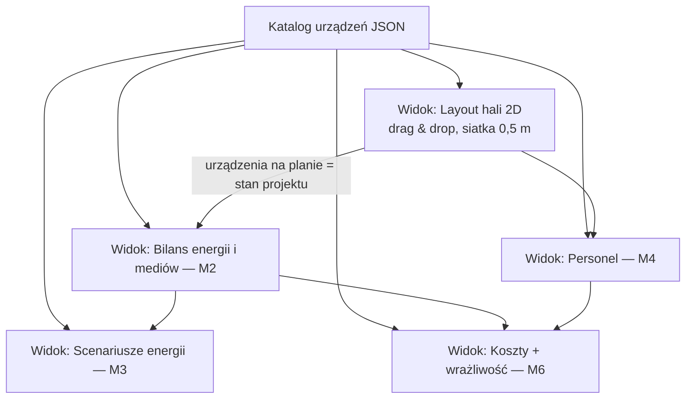

# Symulator fabryki — założenia architektoniczne

> [!abstract] TL;DR
> Jedno narzędzie (single-file HTML) = nasz warsztat pracy nad M2–M5 + generator deliverables (rzut 2D do M5, symulator do M6). Serce: **katalog urządzeń w JSON** — layout i wszystkie widoki liczą z tego samego. Bilanse statyczne, nie symulacja czasu rzeczywistego.

Decyzje Krzyśka z 13.07: narzędzie najpierw wewnętrzne (wersja dla klienta wycinana na końcu) · MVP = katalog + layout + bilanse · docelowo 4 widoki: M2, M3, M4, M6.

---

## Architektura



**Zasada:** przeciągnięcie urządzenia na plan aktualizuje wszystkie bilanse. Stan projektu (co na planie, gdzie, założenia) = jeden plik JSON — wymiana między nami przez ten folder, bez live-collab.

## One-way doors (drogie w zmianie — ustalamy raz)

1. 🔴 **Schemat danych urządzenia** (niżej) — wszystkie widoki na nim wiszą
2. 🔴 **Bilanse statyczne** — świadomie NIE robimy symulacji przepływu w czasie (discrete-event); do STEP wystarczą bilanse, symulacja czasu = studnia bez dna
3. 🟡 Single-file HTML, zapis/odczyt JSON — działa offline u każdego

## Schemat danych urządzenia — DO REVIEW MARCINA

> [!question] Marcin — zweryfikuj pola inżynierskie
> Czy czegoś brakuje (np. hałas? ATEX? wymagania fundamentowe?), czy coś wywalić? Zmiana schematu po starcie kodu = drogo.

```json
{
  "id": "B-04",
  "nazwa": "Piec pirolityczny (LT+HT)",
  "linia": "B",
  "modul_funkcjonalny": "obrobka-termiczna",
  "wymiary_m": { "dl": 12.0, "szer": 3.0, "wys": 4.0, "strefa_serwisowa": 1.5 },
  "energia": { "moc_zainstalowana_kW": 850, "moc_srednia_kW": 600, "praca": "ciagla | zmianowa | wsadowa" },
  "media": { "n2_m3h": 40, "woda_m3h": 0, "sprezone_powietrze_m3h": 0, "cieplo_odpadowe_kW": 200 },
  "personel_na_zmiane": 1,
  "capex_pln": 3500000,
  "ur_pct_capex_rok": 3,
  "wymagania": ["kwasoodporność", "ATEX", "wentylacja", "odciąg"],
  "zrodlo": "D | W | B | U + odnośnik do rejestru"
}
```

Pole `zrodlo` spina każde urządzenie z [[Rejestr danych źródłowych]] — obronialność liczb we wniosku.

## Roadmapa

| Iteracja | Zakres | Odblokowuje |
|---|---|---|
| **1 (MVP)** | schemat + katalog ~15 kluczowych pakietów + layout drag&drop + bilans energii/mediów/powierzchni | M2, M5 |
| 2 | widok personelu + widok kosztów z suwakami założeń | M4, M6 |
| 3 | scenariusze źródeł energii (dane z M3) + analiza wrażliwości | M3, M6 |
| 4 | wycięcie wersji prezentacyjnej dla klienta/doradcy | deliverable M6 |

> [!warning] Czego NIE robimy
> Symulacji sekundę-po-sekundzie · 3D · wszystkich 60 maszyn na start · live-collab · optymalizacji layoutu algorytmem. Deadline 07.08 > perfekcja.

## Otwarte — do ustalenia razem

- [ ] Marcin: review schematu danych (pola inżynierskie)
- [ ] Lista ~15 startowych pakietów urządzeń (z trackera RFQ Marcina — czekamy na wrzutkę do WIEDZA)
- [ ] Wymiary hali / działki — mamy jakiekolwiek założenie od klienta?
- [ ] Format elektrody (pyt. 4 z [[Pytania do klienta]]) — wpływa na wymiary pieca w katalogu

→ nawigacja: [[WIEDZA]] · [[Status modułów M1–M6]]
